**完整代码收费 +   316595344     或    lz316595344  咨询** 

**接毕业设计和论文**

**如果图片加载不出来可以去博客看 https://blog.csdn.net/qq_56450993/article/details/133219142**

**毕业设计所有选题地址**

**[github]👉https://github.com/XinChennn/allProjects**

**[gitee]👉https://gitee.com/xinchennn/allProjects**

**[忻辰的个人博客]👉https://www.ixinjiu.cn/articles/156**

# 基于SpringBoot 超市管理系统

## 一、系统概要
超市管理系统总共分为两个大的模块，分别是系统模块和业务模块。其中系统模块和业务模块底下又有其子模块。

其功能包括：客户管理、供应商管理、商品管理、商品进/退货管理、商品销售(退货)管理、用户管理、角色管理等

## 二、技术选型
后端

* SpringBoot
* Shiro
* MybatisPlus

前端

* LayUI
* DTree

## 三、开发环境
Java、IDEA、Navicat、Git、Maven、MySQL

## 四、页面截图

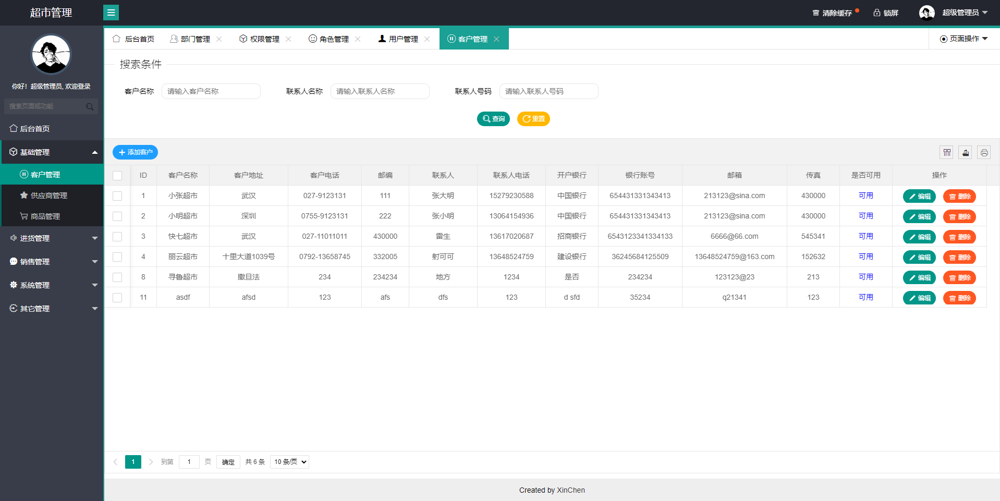

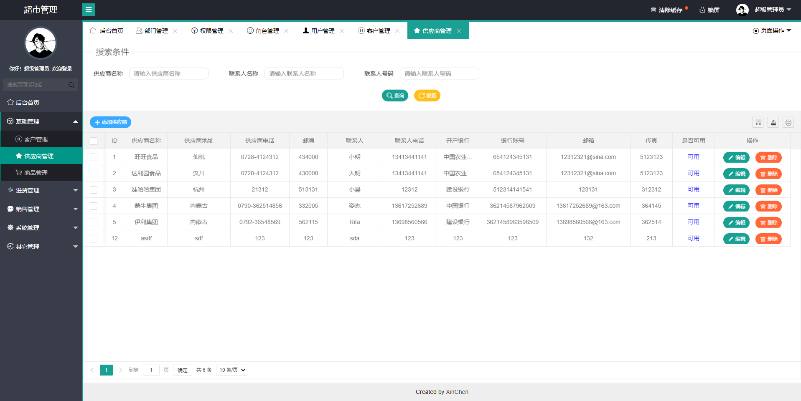

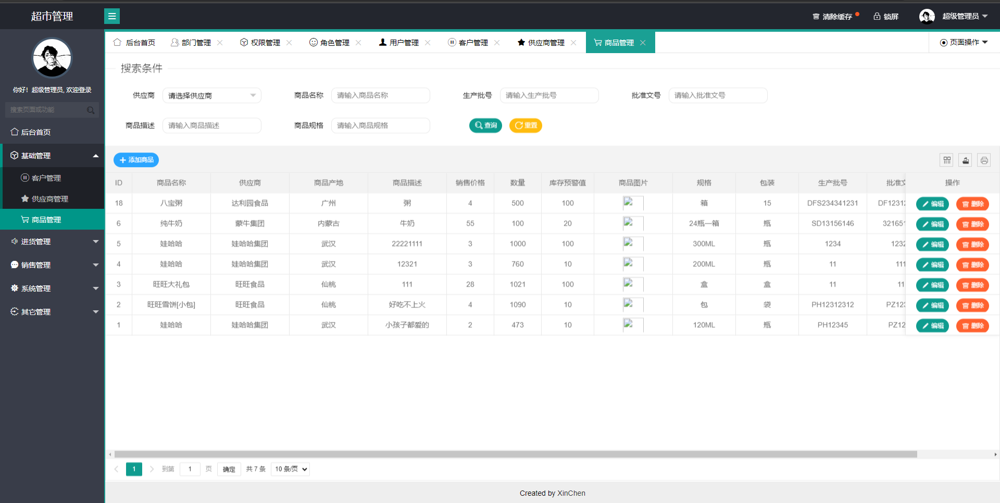

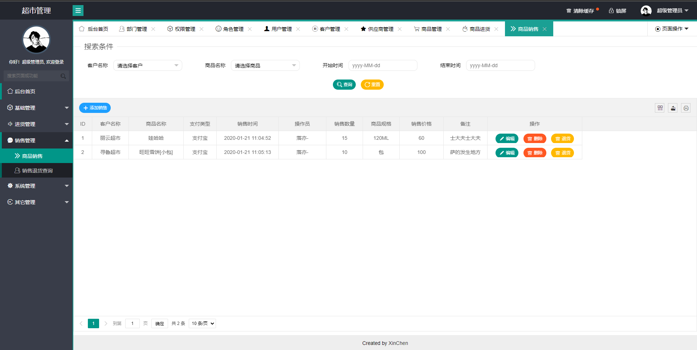

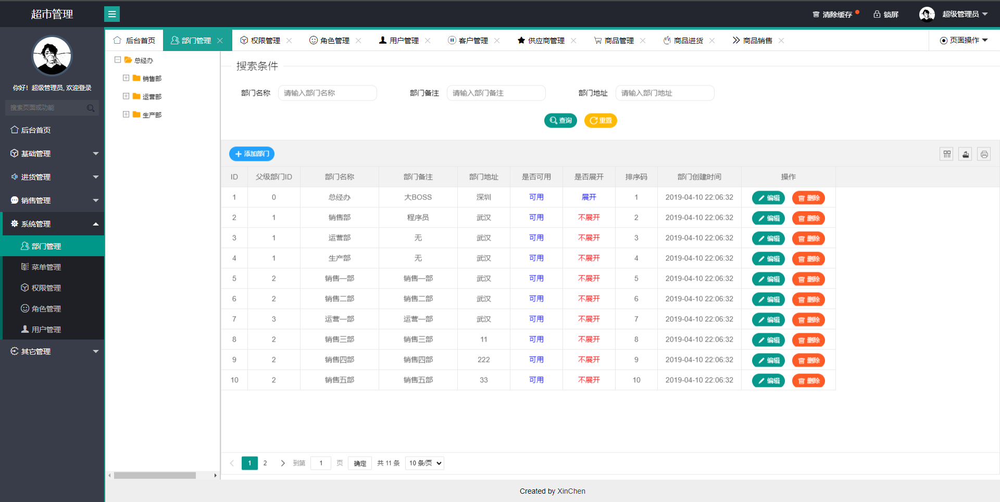

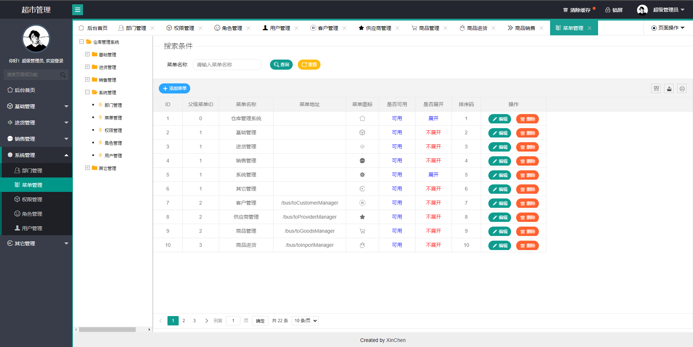

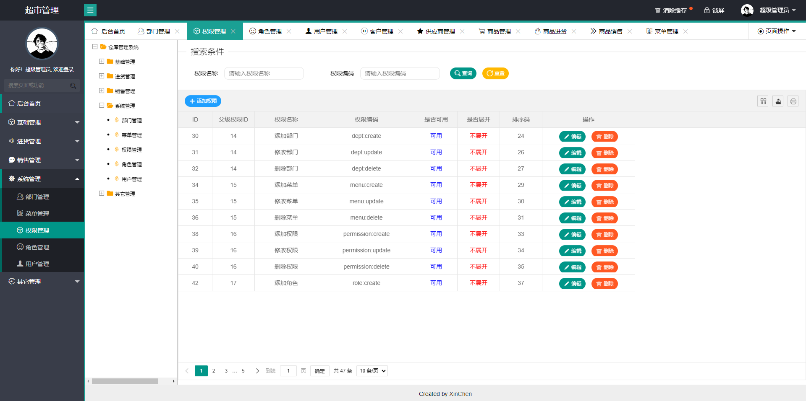

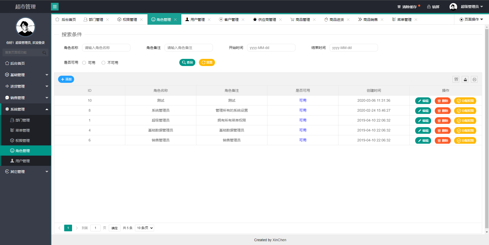

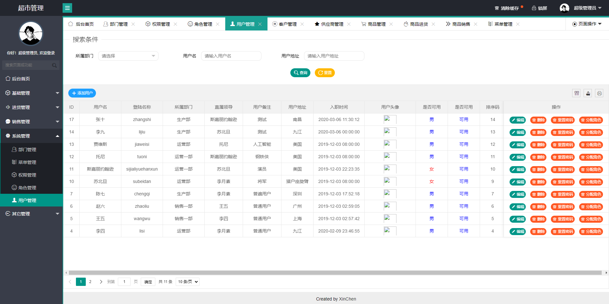

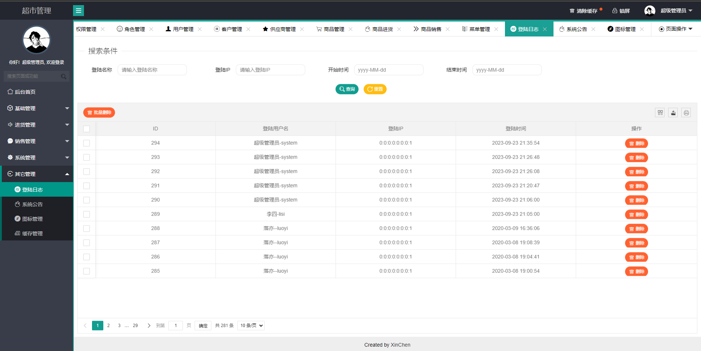

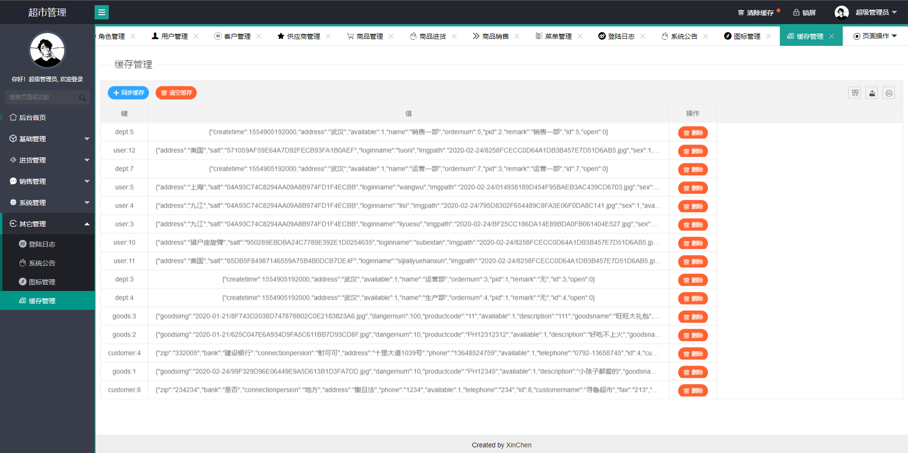

## 五、浏览地址

  - 前台地址 http://localhost:8888/sys/toLogin  账号： system  密码：123456

**需要完整代码 +   316595344     或    lz316595344  咨询**
